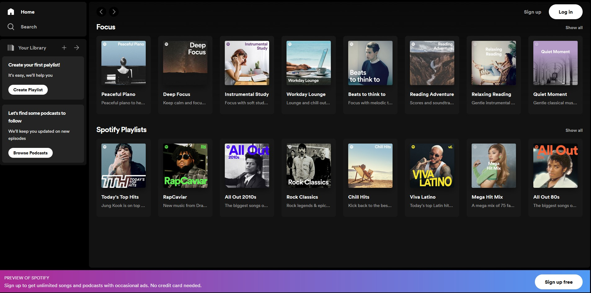
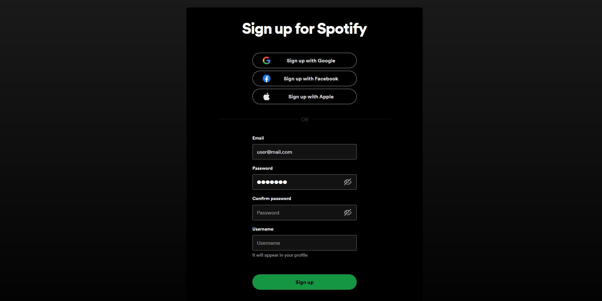
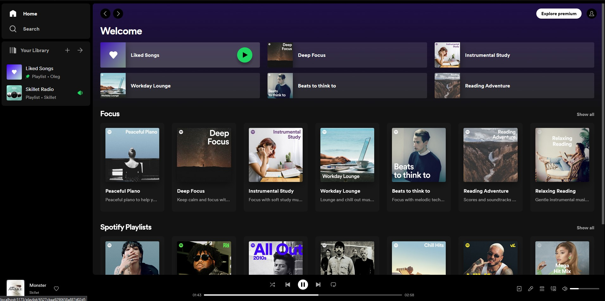
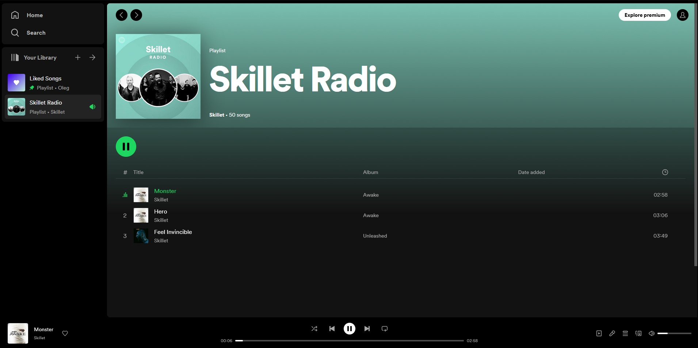

# Spotify-clone






## Project Startup

```
npm install - install dependencies
npm run start or npm run start:webpack - start server + frontend project in dev mode
```

---

## Scripts

- `npm run start:dev:webpack` - Start frontend project on webpack dev server
- `npm run start:dev` - Start frontend project on vite
- `npm run build:prod` - Build in prod mode
- `npm run build:dev` - Build in dev mode (not minimized)
- `npm run lint:ts` - Check ts files with linter
- `npm run lint:ts:fix` - Fix ts files with linter
- `npm run lint:scss` - Check scss files style by linter
- `npm run lint:scss:fix` - Corrects scss files with the linter
- `npm run test:unit` - Run unit tests with jest
- `npm run test:ui` - Run screenshot tests with loki
- `npm run test:ui:ok` - Confirm new screenshots
- `npm run test:ui:ci` - Run screenshot tests in CI
- `npm run test:ui:report` - Generate full report for screenshot tests
- `npm run test:ui:json` - Generate json report for screenshot tests
- `npm run test:ui:html` - Generate HTML report for screenshot tests
- `npm run sb` - Run Storybook
- `npm run sb:build` - Build a storybook build
- `npm run prepare` - precommit hooks

---

## Project Architecture

The project is written according to the Feature sliced design methodology
Documentation link - [feature sliced design](https://feature-sliced.design/docs/get-started/tutorial)

---

## Work with translations

The project uses i18next library to work with translations.
Files with translations are stored in public/locales.
For comfortable work we recommend to install plugin for webstorm/vscode
Documentation i18next - [https://react.i18next.com/](https://react.i18next.com/)

---

## Tests

There are 4 types of tests used in the project:

1. normal unit tests on jest - `npm run test:unit`.
2. tests on components with React testing library - `npm run test:unit`.
3. Screenshot testing with loki `npm run test:ui`
4. e2e testing with Cypress `npm run test:e2e`.
   More information about tests - [documentation testing](/docs/tests.md)

---

## Linting

The project uses eslint to check typescript code and stylelint to check style files.
Also for strict control of the main architectural principles
our own eslint plugin _eslint-plugin-ulbi-tv-plugin_ is used,
which contains 3 rules

1. path-checker - forbids to use absolute imports within one module
2. layer-imports - checks if layers are used correctly from FSD point of view.
   (e.g. widgets cannot be used in features and entitites)
3. public-api-imports - allows import from other modules only from public api. Has auto fix

##### Run lint

- `npm run lint:ts` - Check ts files by linter
- `npm run lint:ts:fix` - Fix ts files with linter
- `npm run lint:scss` - Check scss files with linter
- `npm run lint:scss:fix` - Fix scss style files with linter

---

## Storybook

In the project, storybooks are described for each component.
Requests to the server are mocked using storybook-addon-mock.
A file with storybooks creates next to the component with the extension .stories.tsx
You can run the storybook with the command:

- `npm run sb`.
  Read more about [Storybook](/docs/storybook.md)

---

## Project Configuration

For development, the project contains 2 configs:

1. webpack - ./config/build
2. vite - vite.config.ts
   Both builds are customized for the main features of the application.
   All configuration is stored in /config

- /config/babel - babel
- /config/build - webpack configuration
- /config/jest - test environment configuration
- /config/storybook - storybook configuration

---

## CI pipeline and pre commit hooks

The github actions configuration is in /.github/workflows.
In ci we run all kinds of tests, build project and storybook, linting.
In pre commit hooks we check the project with linters, config is in /.husky

---

### Working with data

Interacting with data is done with redux toolkit.
If possible, overused entities should be normalized with EntityAdapter
Requests to the server are sent using [RTK query](/src/shared/api/rtkApi.ts)
For asynchronous connection of redusers (to avoid pulling them into a common bundle) we use
[DynamicModuleLoader](/src/shared/lib/components/DynamicModuleLoader/DynamicModuleLoader.tsx)

---

### Working with feature-flag

Feature flags can only be used with the toggleFeatures helper.
an object with options is passed to it
{
name: the name of the feature-flag,
on: the function that will be triggered when the feature is enabled
of: the function that will work after the feature is turned OFF
}
To automatically remove a fiche, use the remove-feature.ts script,
which takes 2 arguments

1. The name of the fiche-feature to be removed
2. State (on/off)

---

